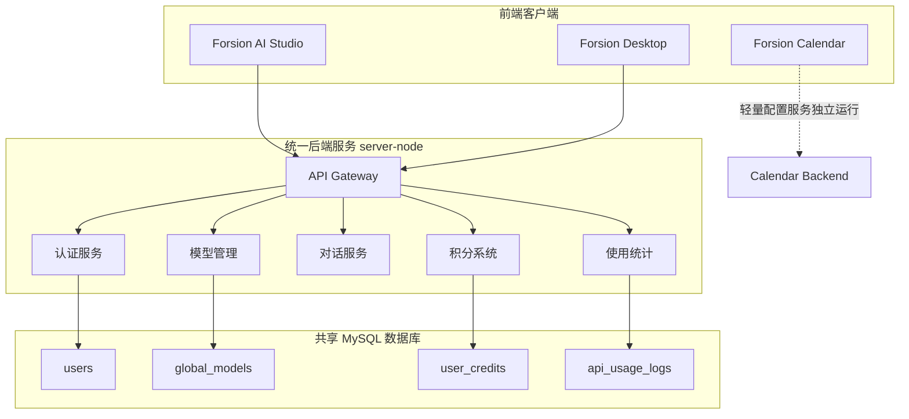

# Forsion AI Studio 统一后端服务改造完成

## 🎉 改造概述

Forsion AI Studio 的后端服务已成功改造为 **Forsion Backend Service**，这是一个通用的、企业级的后端 API 服务，可以为多个 Forsion 项目提供统一的认证、AI 模型管理、对话、积分系统和使用统计功能。

## 📋 完成的改造内容

### 1. 项目重命名和独立化 ✅

- **重命名**: `forsion-ai-studio-server` → `forsion-backend-service`
- **版本升级**: v1.0.0 → v2.0.0
- **描述更新**: 现在明确标识为"统一后端服务"
- **独立文档**: 在 `server-node/README.md` 中提供完整的服务文档

### 2. 增强 CORS 配置 ✅

支持多个 Forsion 项目的前端访问：

```typescript
// 支持的项目端口
const allowedOrigins = [
  'http://localhost:50173', // AI Studio
  'http://localhost:3000',   // Desktop
  'http://localhost:6006',   // Calendar
  // ... 更多端口
];

// 支持生产环境自定义域名
if (process.env.ALLOWED_ORIGINS) {
  allowedOrigins.push(...process.env.ALLOWED_ORIGINS.split(','));
}
```

### 3. 数据库扩展 ✅

在 `api_usage_logs` 表中添加了 `project_source` 字段：

```sql
ALTER TABLE api_usage_logs 
ADD COLUMN project_source VARCHAR(50) DEFAULT 'ai-studio' 
COMMENT '调用来源项目: ai-studio, desktop, calendar 等';

ADD INDEX idx_project_source (project_source);
```

### 4. 使用统计追踪 ✅

更新了 `usageService.ts`，现在可以自动识别和记录 API 调用的项目来源：

```typescript
export async function logApiUsage(
  username: string,
  modelId: string,
  // ... 其他参数
  projectSource?: string  // 新增：项目来源标识
): Promise<void> {
  // 通过 X-Project-Source 请求头自动识别来源
}
```

### 5. 增强的健康检查和元信息接口 ✅

#### `/api/health` - 详细健康检查

```json
{
  "status": "healthy",
  "service": "forsion-backend-service",
  "version": "2.0.0",
  "timestamp": "2025-12-25T10:00:00.000Z",
  "database": "connected"
}
```

#### `/api/info` - 服务元信息

```json
{
  "name": "Forsion Backend Service",
  "version": "2.0.0",
  "supportedProjects": ["ai-studio", "desktop"],
  "features": ["auth", "ai-models", "chat", "credits", "usage-stats"],
  "endpoints": { ... }
}
```

### 6. 优化的环境变量配置 ✅

更新了 `env.example`，支持多项目配置：

```env
# 服务配置
SERVICE_NAME=forsion-backend-service
PORT=3001

# CORS 配置（多项目支持）
ALLOWED_ORIGINS=http://localhost:50173,http://localhost:3000,http://localhost:6006

# 数据库配置（共享）
DB_NAME=forsion_shared_db

# 功能开关
ENABLE_INVITE_CODES=true
ENABLE_CREDIT_SYSTEM=true
```

### 7. 完整的文档体系 ✅

创建了全套文档：

- **[server-node/README.md](server-node/README.md)** - 统一后端服务完整文档
- **[server-node/docs/API.md](server-node/docs/API.md)** - 详细 API 接口文档
- **[server-node/docs/CLIENT_INTEGRATION.md](server-node/docs/CLIENT_INTEGRATION.md)** - 客户端集成指南
- **[server-node/DEPLOYMENT.md](server-node/DEPLOYMENT.md)** - 生产环境部署指南

## 🏗️ 新架构



## 🚀 快速开始

### 启动统一后端服务

```bash
# 进入后端目录
cd server-node

# 安装依赖
npm install

# 配置环境变量
cp env.example .env
# 编辑 .env 文件

# 运行数据库迁移（添加 project_source 字段）
npm run db:migrate

# 启动开发服务器
npm run dev
```

服务将运行在 `http://localhost:3001`

### 前端项目集成

#### AI Studio（已有配置，无需修改）

```env
# client/.env.local
VITE_API_URL=http://localhost:3001
```

#### Desktop（新项目集成）

```typescript
// 在 API 请求中添加项目来源标识
axios.defaults.headers.common['X-Project-Source'] = 'desktop';
```

详细集成步骤请参考：[客户端集成指南](server-node/docs/CLIENT_INTEGRATION.md)

## 📊 主要改进

### 1. 多项目共用

- ✅ AI Studio 和 Desktop 可以使用同一个后端服务
- ✅ 用户可以跨项目登录，账号和积分共享
- ✅ 统一的 API 接口，降低维护成本

### 2. 项目来源追踪

- ✅ 所有 API 调用都记录来源项目
- ✅ 可以按项目统计使用情况
- ✅ 支持精细化的使用分析

### 3. 独立部署能力

- ✅ 可以单独部署后端服务
- ✅ 支持 Docker 容器化
- ✅ 支持多种部署方式（Docker Compose、传统服务器、云平台）

### 4. 完善的文档

- ✅ 详细的 API 文档
- ✅ 客户端集成指南
- ✅ 生产环境部署指南
- ✅ 故障排查指南

## 🔌 API 端点

| 端点 | 说明 |
|------|------|
| `/api/health` | 健康检查（增强版，包含数据库状态） |
| `/api/info` | 服务元信息 |
| `/api/auth/*` | 认证相关接口 |
| `/api/models` | 模型管理 |
| `/api/chat/completions` | AI 对话接口（支持项目来源追踪） |
| `/api/credits/*` | 积分系统 |
| `/api/usage/*` | 使用统计（支持按项目过滤） |
| `/admin` | 管理员面板 |

完整 API 文档：[server-node/docs/API.md](server-node/docs/API.md)

## 📁 项目结构变化

```
Forsion-AI-Studio/
├── server-node/                    # 统一后端服务（已改造）
│   ├── README.md                   # 新增：后端服务文档
│   ├── DEPLOYMENT.md               # 新增：部署指南
│   ├── docs/                       # 新增：文档目录
│   │   ├── API.md                  # API 接口文档
│   │   └── CLIENT_INTEGRATION.md   # 客户端集成指南
│   ├── src/
│   │   ├── index.ts                # 已修改：增强 CORS 和健康检查
│   │   ├── services/
│   │   │   └── usageService.ts     # 已修改：支持项目来源追踪
│   │   ├── routes/
│   │   │   └── chat.ts             # 已修改：提取 X-Project-Source
│   │   └── db/
│   │       └── migrate.ts          # 已修改：添加 project_source 字段
│   ├── package.json                # 已修改：重命名为 forsion-backend-service
│   └── env.example                 # 已修改：添加多项目配置
├── client/                         # 前端应用（无需修改）
└── README.md                       # 本文件
```

## 🎯 支持的项目

### 当前支持

1. **Forsion AI Studio** - 多模型 AI 聊天平台
   - 项目标识：`ai-studio`
   - 默认端口：`50173`

2. **Forsion Desktop** - 桌面 AI 应用
   - 项目标识：`desktop`
   - 默认端口：`3000`

### 可选支持

3. **Forsion Calendar** - 智能日历应用
   - 项目标识：`calendar`
   - 默认端口：`6006`
   - 注：Calendar 保持独立的轻量级后端，可选择性接入统一后端

## 🔄 数据迁移

如果你已有运行中的系统，请运行数据库迁移：

```bash
cd server-node
npm run db:migrate
```

这将添加 `project_source` 字段和相关索引，不会影响现有数据。

## 📚 相关文档

- [后端服务完整文档](server-node/README.md)
- [API 接口文档](server-node/docs/API.md)
- [客户端集成指南](server-node/docs/CLIENT_INTEGRATION.md)
- [部署指南](server-node/DEPLOYMENT.md)
- [原 AI Studio 文档](Documents/README_Forsion_Calendar.md)
- [Forsion Desktop 文档](Documents/README_Forsion_Desk.md)

## 🤝 贡献

欢迎为统一后端服务贡献代码和文档！

## 📄 许可证

MIT License

---

**最后更新**：2025年12月

**改造完成日期**：2025年12月25日

**版本**：v2.0.0


