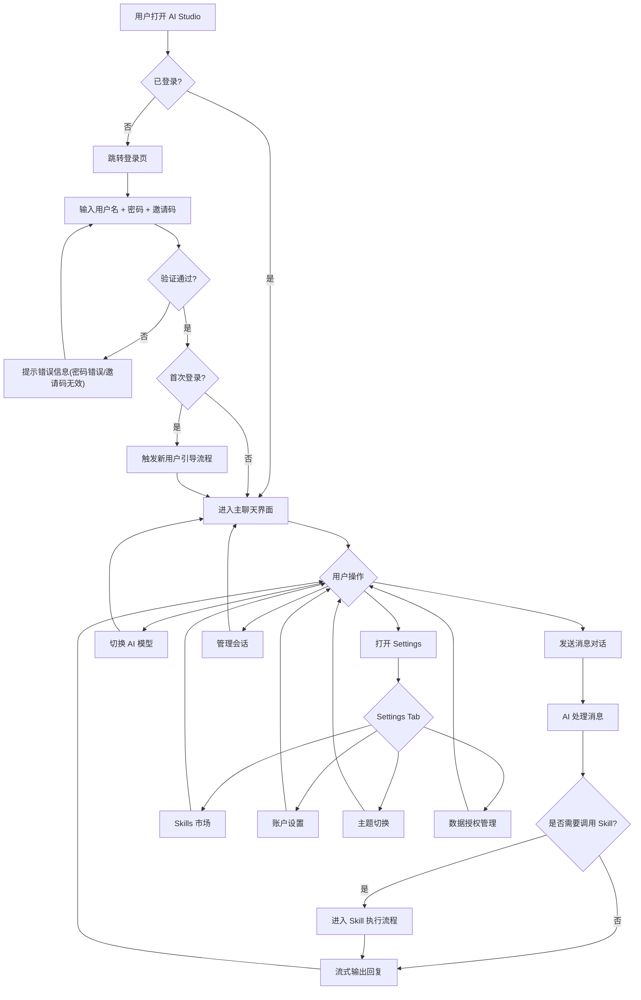
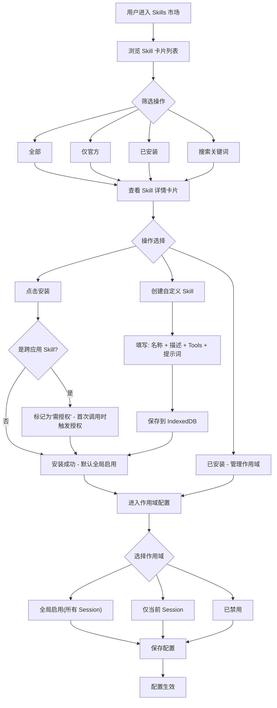
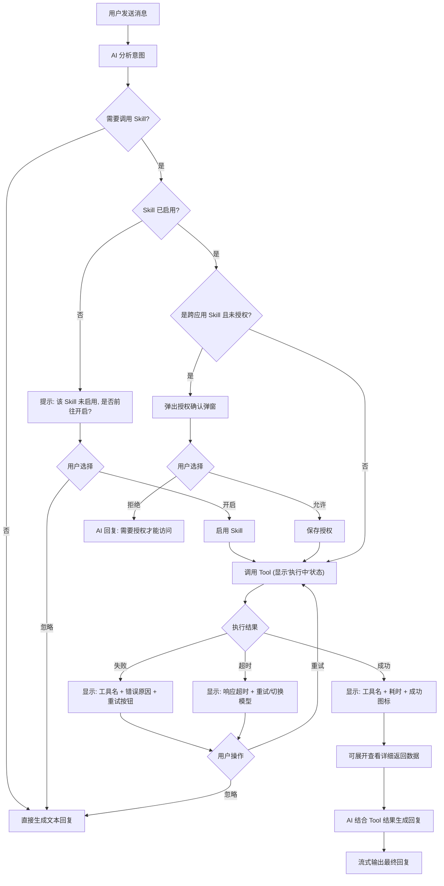
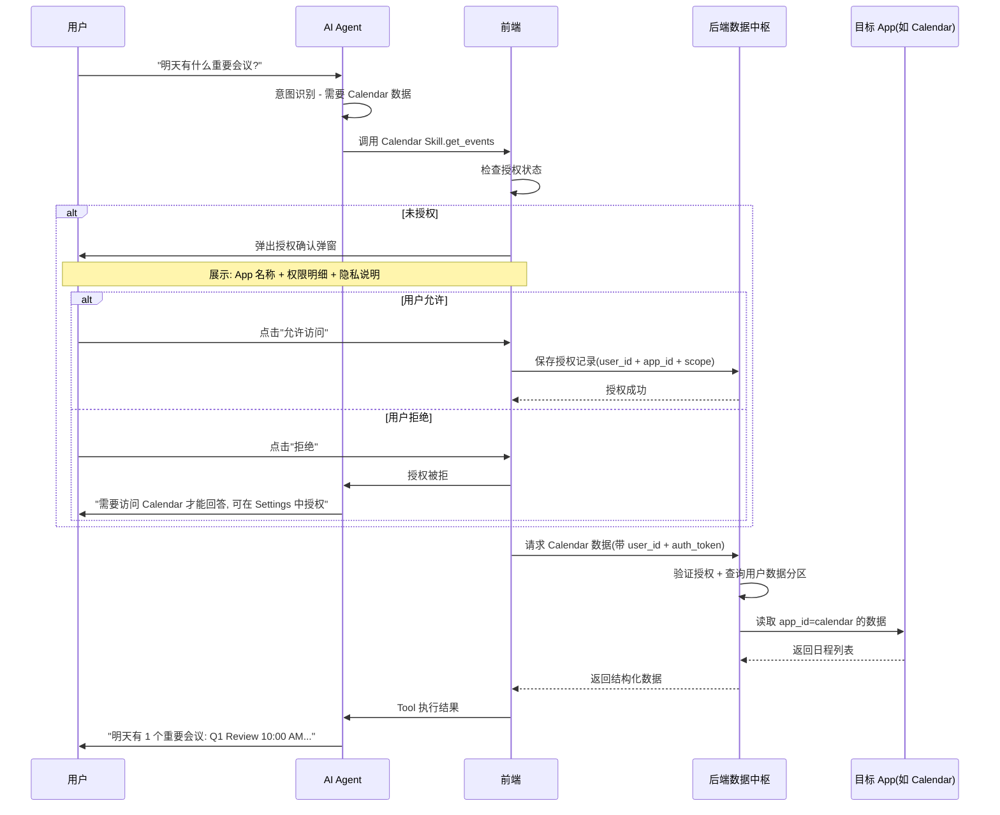
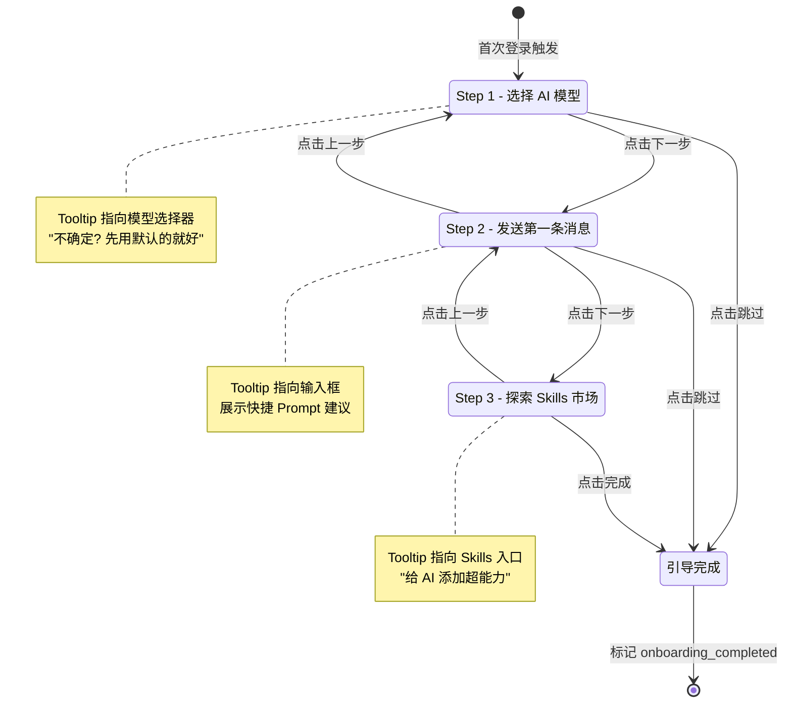
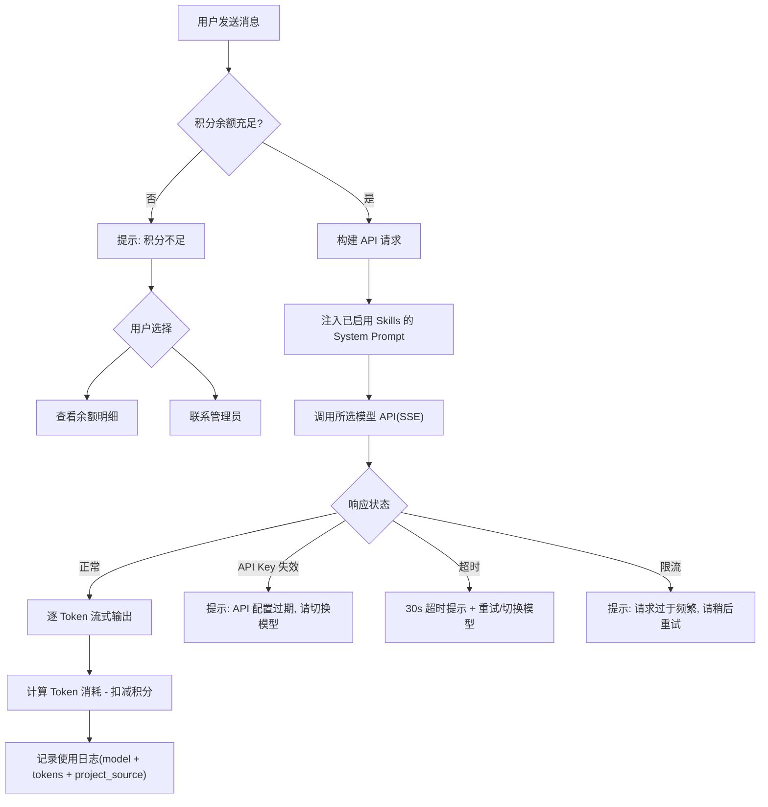

# Forsion AI Studio v1.0 — 核心业务流程图

**版本**：v1.0
**日期**：2026-03-26

---

## 一、用户主流程（整体旅程）

---

## 二、Skills 安装与作用域管理

---

## 三、Skill 执行可视化流程

---

## 四、跨应用数据授权流程

---

## 五、新用户引导流程

---

## 六、积分消耗与模型调用流程

